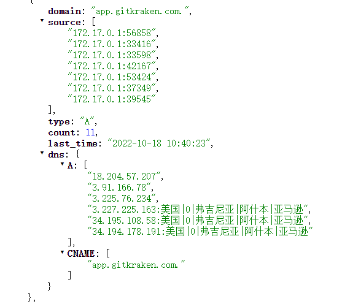

# SkyDNS [](https://travis-ci.org/skynetservices/skydns)
*Version 2.5.3a*

# Local-DNS
* 基于[SkyDns](github.com/skynetservices/skydns)二次开发

## Features
* 该服务主要用来当做自己的local-dns服务, 可配置自身域名解析或者某些域名走指定的NS服务
* backend 使用go.etcd.io/bbolt做存储, 保存dns记录及访问数据


## Start
> docker run -it \
    -p 65532:65532/tcp \
    -p 53:53/udp \
    -e SKYDNS_DOMAIN="cluster.local." \
    -e SKYDNS_NAMESERVERS="114.114.114.114:53,8.8.8.8:53" \
    -e SKYDNS_API="0.0.0.0:65532" \
    -e SKYDNS_ADDR="0.0.0.0:53" \
    -e DB_FILE="/var/dns_db" \
    -e LOG_DIR="/log/" \
    -e IP_DB_FILE="/var/ip2region.xdb" \
    -v :\dns\ip2region.xdb:"/var/ip2region.xdb" \
    -v :\dns\dns_db:/var/dns_db \
    -v :\dns\:/log/ dns:v3


## 操作
```text
### 请求记录
curl --location --request GET 'http://127.0.0.1:65532/api/dns' \
--header 'Content-Type: application/json' \
--data-raw '{}'

### DNS记录
curl --location --request POST 'http://127.0.0.1:65532/api/dnsMgr/ListRecord' \
--header 'Content-Type: application/json' \
--data-raw '{}'

### 域名使用指定NS
curl --location --request POST 'http://127.0.0.1:65532/api/dnsMgr/addRecord' \
--header 'Content-Type: application/json' \
--data-raw '[
    {
        "key": "xxx.com",
        "host": "127.0.0.10:53",
        "Text": "ns"
    },
    {
        "key": "aaa.com",
        "host": "127.0.0.10:53",
        "Text": "ns"
    },
    {
        "key": "xxx.com",
        "host": "8.8.8.8:53",
        "Text": "ns"
    }
]'

### A记录
curl --location --request POST 'http://127.0.0.1:65532/api/dnsMgr/addRecord' \
--header 'Content-Type: application/json' \
--data-raw '[
    {
        "key": "www.aa.com",
        "host": "127.0.0.8"
    },
	{
        "key": "www.aa.com",
        "host": "127.0.0.9"
    }
]'

### CNAME
curl --location --request POST 'http://127.0.0.1:65532/api/dnsMgr/addRecord' \
--header 'Content-Type: application/json' \
--data-raw '[
    {
        "key": "www.aa.com",
        "host": "www.baidu.com"
    }
]'

### 删除
curl --location --request GET 'http://127.0.0.1:65532/api/dnsMgr/RemoveDnsRecord?domains=dddd.com'
```

### VIEW



